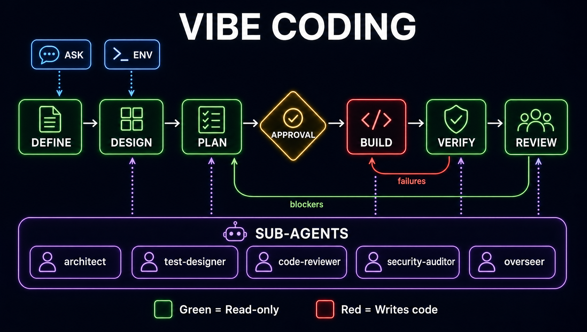

# vibe-coding

A Claude Code skill that manages the **full lifecycle of building software with AI
agents** — research, spec definition, design, planning, checkpointed implementation
(including approved autonomous "autopilot" runs), verification, and review.

It ships as one skill (`vibe-coding`), a `/vibe` slash command, and five read-only
specialist sub-agents (`vibe-architect`, `vibe-test-designer`, `vibe-code-reviewer`,
`vibe-security-auditor`, `vibe-overseer`) that the skill dispatches when installed.



## Pipeline

```
define → design → plan → build → verify → review
```

`ask` (read-only investigation) and `env` (persist project commands into CLAUDE.md) are
available at any point. Modes are a soft pipeline: each writes its artifacts into a
timestamped run directory and names the next mode; you can enter at any stage.

All runtime artifacts (`spec.md`, `design.md`, `plan.md`, `findings.json`, …) are written
to **the target repo's** `.claude/vibe-reports/<timestamp>/`, never to your home
directory — they belong next to the code they describe.

## Install

### Option A — as a plugin (recommended)

```
/plugin marketplace add apisani1/vibe-coding
/plugin install vibe-coding
```

The plugin bundles the skill, command, and all five agents together, namespaced under
`vibe-coding`. Invoke the command as `/vibe-coding:vibe <mode>` (natural-language
triggering — "vibe code this", "write a spec first", "review what we built" — works
the same as with a manual install).

### Option B — manual install

Copy the three component groups into your Claude Code config. Use `~/.claude/` for a
user-global install (available in every project) or `<project>/.claude/` to scope it to
one project.

| Component | Copy to |
|---|---|
| `skills/vibe-coding/` | `~/.claude/skills/vibe-coding/` |
| `agents/*.md` | `~/.claude/agents/` |
| `commands/vibe.md` | `~/.claude/commands/vibe.md` |

Install all three together — the skill dispatches the agents by name and `/vibe` is the
command entrypoint; copying only the skill degrades sub-agent orchestration to the
inline fallback. With a manual install the command is the bare `/vibe <mode>`.

> The skill discovers its agents at runtime and dispatches each by the correct
> registered name automatically — bare (`vibe-architect`) for a manual install,
> namespaced (`vibe-coding:vibe-architect`) under a plugin — so the same files work
> both ways with no edits.

## Usage

```
/vibe define              # interview + write spec.md for a new or existing target
/vibe design              # architecture from the spec, critiqued by vibe-architect
/vibe plan ~/code/myproj  # risk-ordered checkpoint plan + verification plan
/vibe build               # checkpointed implementation (explicit approval per scope)
/vibe build --auto        # autopilot: vibe-overseer approves each checkpoint (opt-in)
/vibe verify              # run the verification plan, write verify-report.md
/vibe review --ci --json  # headless review: findings.json to stdout, CI exit codes
/vibe ask "why …?"        # read-only investigation, writes nothing
/vibe env                 # persist this repo's build/test/lint commands into CLAUDE.md
```

Per-agent model overrides can be set in the target repo's
`.claude/vibe-coding.local.md` (YAML frontmatter `models:` map plus
`auto_max_checkpoints`).

### Preference profile (bare greenfield)

When you start a **bare** greenfield project (an empty directory), there are no repo
conventions for the skill to detect, so it consults a **user-scoped preference profile** —
set up once, never copied per repo:

```
~/.claude/vibe-coding/profile/
├── preferences.md   # frontmatter (uv, black/119, isort, pytest, mypy, …) + style prose
└── assets/          # .vscode/settings.json, .editorconfig, .gitignore, … copied verbatim
```

Bootstrap it by copying the shipped example:

```
cp -r skills/vibe-coding/assets/profile-example ~/.claude/vibe-coding/profile
```

The profile seeds a new repo two ways, both approval-gated and **add-only** (never
overwrites your files): automatically as `build`'s first checkpoint, or on demand via
`/vibe env`. `pyproject.toml` is synthesized from your preferences. Scaffolded and
existing repos ignore the profile — they already carry their own conventions.

## Acknowledgments

This project was inspired by:

- **Islem Maboud's** [Agentic Engineering Skills](https://github.com/ipenywis/skills) for
  building better and faster with coding agents, inspired by the workflow Andrej Karpathy
  uses to build quality software faster and more reliably with AI agents.
- **Forrest Chang's** [LLM behavioral skill](https://github.com/multica-ai/andrej-karpathy-skills),
  inspired by Andrej Karpathy's Claude Code programming guidelines.
- **Arjan Egges's** [7-step Software Design Guide](https://www.arjancodes.com/designguide/).

We thank the original authors for their contributions and ideas.

## License

MIT — see [LICENSE](LICENSE).
