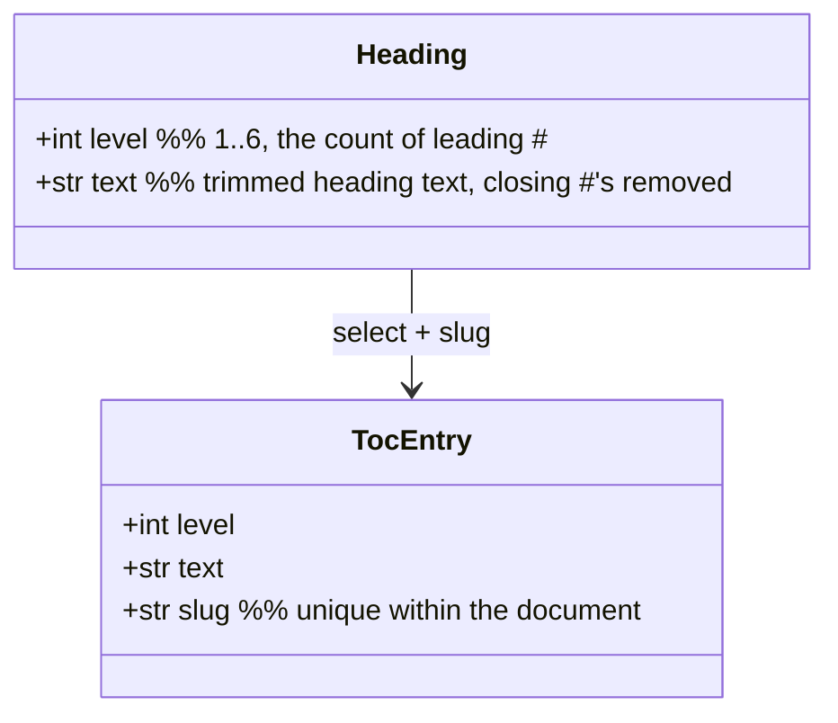
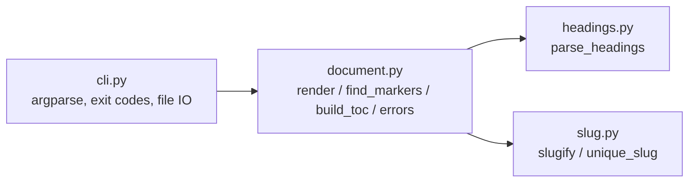

# Design: mdtoc — Markdown TOC injector

Upstream spec: ../2026-07-12T22-36-21Z/spec.md

## Overview
`mdtoc` is a pure text transform wrapped in a thin CLI. The whole tool is one function
of the file's text: `render(text, max_depth) -> new_text`. Everything else — reading the
file, deciding whether to write, choosing an exit code — is I/O and control flow around
that function.

`render` runs a fixed pipeline:

1. **Normalize** line endings to LF and record whether a body was present.
2. **Locate the marker pair** `<!-- toc -->` … `<!-- /toc -->`. Absent/malformed →
   raise; the CLI turns that into exit code 2.
3. **Scan headings** from the whole document, skipping fenced code blocks.
4. **Select & slug** the headings: drop a leading H1 title, filter by `max_depth`,
   assign Python-Markdown-compatible slugs with `_1`/`_2` collision suffixes.
5. **Render** a nested bullet list and **splice** it between the markers, leaving every
   byte outside the markers untouched (modulo the accepted LF normalization).
6. **Guarantee a single trailing newline.**

The design's load-bearing invariant, from which idempotence and `--check` both fall out:

> **`render` is a fixed point:** `render(render(text)) == render(text)`. Equivalently,
> the file is "current" iff `render(text) == text`. A normal run writes `render(text)`;
> `--check` writes nothing and exits non-zero exactly when `render(text) != text`.

Because `--check` and the writer both derive their decision from the *same* canonical
output, they can never disagree — "write is a no-op" and "check passes" are the same
predicate.

## Data model
No persistence, no config. Two in-memory structures:



`Heading` is the raw scan result; `TocEntry` adds the resolved unique slug. Slug
uniqueness state is a plain `set[str]` of already-used slugs, threaded through slug
assignment — no registry object.

## Module & component design
`src/mdtoc/`, functions over classes throughout; the only "state" is the slug set,
passed explicitly.



Four modules after folding the two thinnest seams (architect review, D8): `toc.py`'s
`build_toc` and the tiny error hierarchy both live in `document.py`, since neither has a
second consumer and both are pure string/list transforms behind `render`.

| Module | Responsibility | Key functions |
| --- | --- | --- |
| `slug.py` | Replicate Python-Markdown slugging | `slugify(text) -> str`; `unique_slug(slug, used: set[str]) -> str` |
| `headings.py` | Scan ATX headings, ignore fenced code | `parse_headings(lines) -> list[Heading]` |
| `document.py` | Pipeline: marker location, region-excluded scan, TOC build, splice; typed errors | `render(text, max_depth) -> str`; `find_markers(lines)`; `build_toc(headings, max_depth) -> str`; `MdtocError`, `MissingMarkersError`, `MalformedMarkersError` |
| `cli.py` | Parse args, read/write file, map results to exit codes | `main(argv=None) -> int` |
| `__main__.py` | `python -m mdtoc` entry | delegates to `cli.main` |

**Separation of creation from use:** `cli.py` *creates* inputs (reads the file, parses
args) and *consumes* results (writes / exits). The pure core (`render`) never touches the
filesystem or `sys.exit`, so it is trivially testable string-in/string-out.

### Key function contracts
- `slugify(text)` — NFKD-normalize, drop non-ASCII, `re.sub(r'[^\w\s-]', '', v).strip().lower()`,
  then collapse `[-\s]+` → `-`. Matches Python-Markdown's default `slugify` with
  `separator='-'`, `unicode=False`.
- `unique_slug(slug, used)` — Python-Markdown's `unique()`, faithfully: with
  `IDCOUNT_RE = re.compile(r'(.*)_([0-9]+)$')`, `while slug in used or not slug:` if
  `IDCOUNT_RE` matches, bump the trailing integer (`f"{m[1]}_{int(m[2]) + 1}"`), else
  append `_1`; then `used.add(slug)` and return. (Empty slug → `_1`.) **The anchored
  regex matters:** a heading whose text legitimately ends in `_<n>` (e.g. `Section _2`)
  must be treated exactly as Python-Markdown does — do not substitute a looser
  `endswith` check.
- `parse_headings(lines)` — single pass over the **document with the managed marker
  region already excluded** (see `render`; callers never pass TOC-block lines in). Track
  fenced-code state: a line whose stripped form starts with ```` ``` ```` or `~~~`
  toggles "in code"; headings are only recognized outside code. A heading line matches
  `^(#{1,6})[ \t]+(.*?)[ \t]*#*[ \t]*$` (whitespace after the hashes is required, so
  `#NoSpace` is not a heading; `## ` with empty text is a heading with empty text →
  empty slug → `_1`); `level = len(hashes)`, `text = group(2)`. **Unterminated fence:**
  an odd number of fence lines leaves the scanner "in code" to EOF, silently omitting
  every later heading — intended MVP behavior, called out in the edge-case table.
- `build_toc(headings, max_depth)`:
  1. If `headings` is non-empty and `headings[0].level == 1`, drop `headings[0]` (leading
     H1 title rule — only the first heading, only if H1).
  2. Keep headings with `level <= max_depth`.
  3. `base = min(h.level for h in kept)`; indent unit = 2 spaces; a heading's indent is
     `(h.level - base)` units. (Relative indentation — a doc starting at H2 isn't
     over-indented.)
  4. Assign slugs via `slugify` + `unique_slug` in document order, using one shared
     `used` set.
  5. Emit `"{indent}- [{text}](#{slug})"` per entry; join with `\n`. Empty kept-set →
     empty string.
- `render(text, max_depth)`:
  - `text = text.replace("\r\n", "\n").replace("\r", "\n")`.
  - `lines = text.split("\n")`; `open_i, close_i = find_markers(lines)` (raise on
    missing/malformed).
  - **Scan only outside the managed region:** parse headings from
    `lines[:open_i] + lines[close_i + 1:]` so the TOC bullets can never influence the
    scan or the fence counter. (Removes the review's "correctness leans on bullets not
    looking like headings" risk.)
  - `body = build_toc(parse_headings(scan_lines), max_depth)`.
  - **Splice with a pinned whitespace contract:** rebuild as
    `lines[:open_i+1]` + (`[""] + body.split("\n") + [""]` when `body` is non-empty, else
    `[""]`) + `lines[close_i:]`. i.e. exactly one blank line separates each marker from
    the body (and a single blank line sits between the markers when the TOC is empty).
    Join with `\n`; strip trailing newlines and append exactly one. The blank line makes
    the list render under CommonMark regardless of the preceding marker comment, and —
    being deterministic — keeps `render` a fixed point.
- `find_markers(lines)` — **fence-aware**: it runs the same fenced-code tracking as
  `parse_headings`, so a `<!-- toc -->`/`<!-- /toc -->` line *inside* a code fence (e.g.
  a README documenting mdtoc's own syntax) is ignored. Among non-fenced lines it takes
  the first stripped-equal `<!-- toc -->` and the first `<!-- /toc -->` after it. Missing
  open or close → `MissingMarkersError`; close-before-open or a second `<!-- toc -->`
  before the close → `MalformedMarkersError`.

## Key algorithms & libraries
- **Standard library only** — `re`, `unicodedata`, `argparse`, `sys`, `pathlib`. The slug
  algorithm and marker splice are ~40 lines of `re`; pulling in `markdown` or `mistune`
  would add a parse tree we don't need and would risk *diverging* from the exact slug
  behavior we must replicate. (Python-stack hook: prefer stdlib when within ~20% of the
  convenience — here stdlib is simpler *and* more faithful.)
- **Slug faithfulness** is a copy of Python-Markdown's `toc` extension `slugify()` +
  `unique()`, not an import, so mdtoc has zero runtime dependencies and its behavior is
  pinned by our own tests rather than a transitive version.
- **argparse** for the CLI: `path` (positional), `--check`, `--max-depth N` (int, default
  6). No third-party CLI framework needed for three options.

## Edge cases & failure modes
| Case | Behavior |
| --- | --- |
| No `<!-- toc -->` and/or `<!-- /toc -->` | `MissingMarkersError` → stderr message naming the missing marker(s), exit 2, file untouched. |
| Close marker before open, or two opens | `MalformedMarkersError` → exit 2, untouched. |
| File missing / unreadable | `cli` catches `OSError` → stderr, exit 2, nothing written. |
| Empty markers, no headings in doc | Region collapses to adjacent marker lines (empty body); idempotent. |
| Headings only inside code fences | Ignored; TOC empty. |
| **Unterminated code fence** | Scanner stays "in code" to EOF; headings after the lone fence are silently omitted (no error). Intended MVP behavior; covered by a fixture. |
| **`<!-- toc -->` marker inside a code fence** | Ignored by the fence-aware `find_markers`; does not create or corrupt a managed region (e.g. mdtoc's own README examples). |
| Duplicate heading text | Distinct slugs: bare, then `_1`, `_2`, …. |
| Heading text ending in `_<n>` (e.g. `Section _2`) | Slugged exactly as Python-Markdown's anchored `unique()` regex dictates — pinned by a fixture. |
| Leading H1 title | Dropped from TOC; subsequent H1s (if any) listed normally. |
| Document starts at H2/H3 | Relative indentation: shallowest kept level is indent 0. |
| `--max-depth 1` with H1 skipped | Likely empty TOC (only H1 exists at level ≤1, and it's the skipped title) — valid, not an error. |
| Heading text with inline markdown (`**x**`, `` `x` ``) | **Displayed verbatim**; slug still strips punctuation. Known limitation (see below). |
| CRLF input | Normalized to LF (accepted policy); after first run the file is LF and stable. |
| `--check` on CRLF-only difference | Reports stale, consistent with the write path. |

## Ripple effects (ArjanCodes step 6)
- **Documentation to update:** README.md (usage, exit codes, slug-style note, the
  idempotence/`--check` invariant, CRLF→LF caveat). This is a new repo, so README is
  created, not updated.
- **Users/systems to notify:** none — greenfield, no consumers yet.
- **External systems affected:** none. No network, no persisted state, writes only the
  one target file (and nothing in `--check`).

## Broader context (ArjanCodes step 7)
- **Limitations of this design:**
  - Heading *display* text is emitted verbatim, so inline markdown/HTML in a heading
    shows up literally in the link text (the slug is still clean). Full fidelity would
    require stripping inline markup — deferred.
  - ATX only; Setext headings are invisible to the scanner (accepted for MVP).
  - One slug dialect (Python-Markdown). GitHub/other renderers would mis-link.
  - LF normalization can touch bytes outside the markers on CRLF files — a deliberate
    trade for a clean idempotence guarantee.
  - Fenced-code tracking is line-prefix based; it doesn't model indented code blocks or
    nested/mismatched fence lengths beyond the common ```` ``` ````/`~~~` toggle. An
    unterminated fence therefore swallows later headings silently (documented, tested).
- **Possible future extensions:** `--slug-style {python,github}`; multi-file / glob input
  with partial-failure reporting; `--min-depth`; configurable marker strings; a
  `--stdout` pipe mode; inline-markup stripping for display text.
- **Moonshots:** a `--watch` mode that re-injects on save; a pre-commit hook shipped in
  the package; auto-detecting the renderer (MkDocs vs GitHub) from repo config and
  picking the slug style accordingly.
