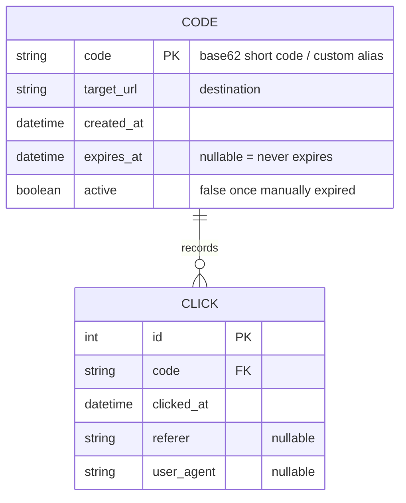

# Spec: URL Shortener Service

## Goal

Provide a single, self-hostable service that turns long URLs into short codes,
redirects visitors from a short code to the original URL, and reports how often each
code is used. It is for a developer or small team who wants their own shortener
(branded/private links, no third-party dependency) without standing up a database
server — persistence is a single SQLite file. Operators create and inspect codes over
an HTTP API guarded by an API key; they manage the code lifecycle (list, force-expire,
delete) from a local CLI that talks to the same database file. Codes can carry an
optional expiry, and every redirect is recorded so per-code analytics are available.

## Main concepts

- **Code** — the short identifier that maps to a target URL. Auto-generated base62 by
  default; the caller may request a custom alias. Has a lifecycle: active → expired
  (by TTL passing or by a manual expire) and can be deleted outright.
- **Click** — one row per successful redirect, capturing when it happened and minimal
  request context (referrer, user-agent). No IP is stored.
- **Expiry** — a code stops redirecting when either its `expires_at` timestamp has
  passed *or* it has been manually deactivated. Expired codes return `410 Gone`.
- **Stats** — a per-code aggregation over its clicks: total count, a time-bucketed
  series, and top referrers.

## Users & user stories

**Operator (via HTTP API, authenticated with an API key)**

- As an operator, I POST a long URL and get back a short code, so that I can share a
  compact link. *(happy path)*
- As an operator, I may include a custom alias in the create request, so that the link
  is human-readable. If the alias is already taken I get `409 Conflict`. *(alt flow)*
- As an operator, I may include an `expires_at` when creating a code, so that the link
  self-destructs after a date; if I omit it the code never auto-expires. *(alt flow)*
- As an operator, I GET a code's stats and see total clicks, clicks over time, and top
  referrers, so that I can judge whether the link is used. *(happy path)*
- As an operator, if I submit a malformed URL or a bad/missing API key, I get a clear
  4xx error and no code is created. *(unhappy path)*

**Visitor (public, no auth)**

- As a visitor, I GET a short code URL and am redirected (`302`) to the target, so that
  the link "just works"; the click is recorded. *(happy path)*
- As a visitor, if the code does not exist I get `404`; if it exists but is expired or
  deactivated I get `410 Gone`. *(unhappy paths)*

**Admin (via CLI, local, operates directly on the SQLite file)**

- As an admin, I list all codes with their status (active / expired / deactivated),
  target, creation date, expiry, and click count, so that I can audit what exists.
- As an admin, I expire a code by name, so that it stops redirecting immediately without
  deleting its history.
- As an admin, I delete a code, so that it and its click history are removed entirely.
- As an admin, if I reference a code that doesn't exist, the CLI reports it and exits
  non-zero rather than failing silently. *(unhappy path)*

## Scope

- **In (MVP):**
  - SQLite persistence layer (schema + typed data-access functions) as the single source
    of truth shared by the API and the CLI.
  - HTTP API: `POST /api/codes` (create; auto or custom alias; optional `expires_at`),
    `GET /{code}` (redirect + record click), `GET /api/codes/{code}/stats` (per-code
    analytics). API key required for the two `/api/*` endpoints; redirect is public.
  - CLI admin: `list`, `expire <code>`, `delete <code>` against the same DB file.
  - Click analytics: one row per redirect (timestamp, referrer, user-agent); stats
    endpoint returns total, a time-bucketed series, and top referrers.
  - Expiry: optional `expires_at` at creation + manual expire; expired/deactivated codes
    return `410`. Expiry is enforced at redirect time (a code past its TTL never
    redirects, regardless of the `active` flag).
  - Single deployable unit: one package, one process for the API, one console entry
    point for the CLI, one SQLite file.
  - Config via environment variables (DB path, API key, bind host/port).
- **Out (deferred, with reason):**
  - User accounts / multi-tenant ownership of codes — MVP is single-operator (one API
    key). *(scope)*
  - Web UI / dashboard — API + CLI only for MVP. *(scope)*
  - IP capture, geolocation, unique-visitor counting — deliberately excluded for a
    lighter privacy footprint; revisit if needed. *(privacy)*
  - Rate limiting / abuse protection beyond the API key. *(scope; note as a limitation)*
  - Postgres/MySQL or any networked DB, and horizontal scale-out — SQLite by design.
    *(constraint)*
  - Click-record retention/pruning policy — clicks accumulate; pruning is a later
    concern. *(scope)*
  - Custom short domains / link previews / QR codes. *(scope)*

## Constraints

- **Language/runtime:** Python 3.12; packaged and run with **UV**.
- **Persistence:** SQLite only (stdlib `sqlite3`), a single database file; no external
  DB server. The API and CLI both open the same file.
- **Single deployable service:** one installable package exposing an API server process
  and a CLI console script; no separate services.
- **Toolchain (from user profile):** Black (line length 119), isort, flake8 + pylint,
  mypy, pytest; `src/` layout; MIT license; pre-commit configured. Project files
  (`pyproject.toml`, `.pre-commit-config.yaml`, `.editorconfig`, `.gitignore`,
  `.vscode/settings.json`) are seeded from the user preference profile at build
  checkpoint 0.
- **Style philosophy (from profile):** functions over classes unless real state must be
  encapsulated; small, pure, composable units; separate construction from use (pass the
  DB connection/path in, don't construct it inside domain functions); explicit type
  annotations on public functions; no bare `except`; every public behavior has a pytest
  test named for the behavior.
- **Secrets:** API key supplied via environment variable, never committed; never logged.
- **HTTP framework:** left to `design` (a stdlib or lightweight framework choice); the
  spec does not mandate one.

## Acceptance criteria

Each is observable via a test, command, HTTP call, or DB inspection.

1. **Create (auto):** `POST /api/codes` with a valid URL and a valid API key returns
   `201` with a JSON body containing a non-empty base62 `code`; a matching row exists in
   SQLite.
2. **Create (custom alias):** the same POST with a free custom alias returns `201` and
   that exact code; repeating it with the same alias returns `409` and creates no
   duplicate row.
3. **Auth enforced:** `POST /api/codes` and `GET /api/codes/{code}/stats` with a missing
   or wrong API key return `401`/`403` and no state change.
4. **URL validation:** `POST /api/codes` with a malformed/unsupported URL returns `4xx`
   and creates no row.
5. **Redirect + record:** `GET /{code}` for an active code returns a `302` to the exact
   target URL and inserts exactly one click row (timestamp set; referrer/user-agent
   captured when sent).
6. **Unknown code:** `GET /{code}` for a non-existent code returns `404` and records no
   click.
7. **Expiry (TTL):** a code created with an `expires_at` in the past (or reached) returns
   `410` on redirect and records no click.
8. **Expiry (manual):** after `cli expire <code>`, `GET /{code}` returns `410`; the code
   and its prior clicks remain in the DB.
9. **Stats:** `GET /api/codes/{code}/stats` (with key) returns JSON with the correct
   total click count, a time-bucketed series, and top referrers for that code.
10. **CLI list:** `cli list` prints every code with its status, target, created/expiry
    dates, and click count; output reflects the DB state.
11. **CLI delete:** `cli delete <code>` removes the code and its clicks; a subsequent
    `GET /{code}` returns `404` and `cli list` no longer shows it.
12. **CLI unknown code:** `cli expire`/`delete` on a non-existent code prints an error and
    exits non-zero.
13. **Shared store:** a code created via the API is visible to `cli list`, and a code
    expired via the CLI is `410` on the API — proving both use the same SQLite file.
14. **Single deployable:** a clean `uv`-based setup runs both the API server and the CLI
    console script from the one installed package.
15. **Quality gate:** `pytest` passes and the profile toolchain (black check, isort,
    flake8, pylint, mypy) is clean on the source.

## Assumptions

- Single operator / single API key for the whole service (no per-user ownership) — from
  the "API key" auth choice.
- Redirect uses HTTP `302` (temporary) so analytics are always hit and targets can be
  repointed later; `301` is not required. *(default; revisit in design if permanent
  redirects are wanted)*
- Short codes are case-sensitive base62 (`[A-Za-z0-9]`), default length chosen in design
  to keep collisions negligible for expected volume.
- Only `http`/`https` target URLs are accepted; other schemes are rejected by URL
  validation.
- The CLI operates on the SQLite file directly (not through the HTTP API); it therefore
  runs where the DB file is reachable. *(from "CLI operates on the same DB file")*
- Time is stored in UTC; expiry comparisons are UTC.
- "Time-bucketed series" defaults to per-day buckets; exact bucketing finalized in design.
- Concurrency is light (single SQLite writer); WAL mode / busy-timeout handling is a
  design detail, not a spec requirement.

## Open questions

- None blocking. The four forking decisions (API auth, code generation, expiry model,
  click data captured) were resolved during the interview. Redirect status code (302 vs
  301) and default code length/bucket granularity are recorded as assumptions to confirm
  or adjust in `design`.
