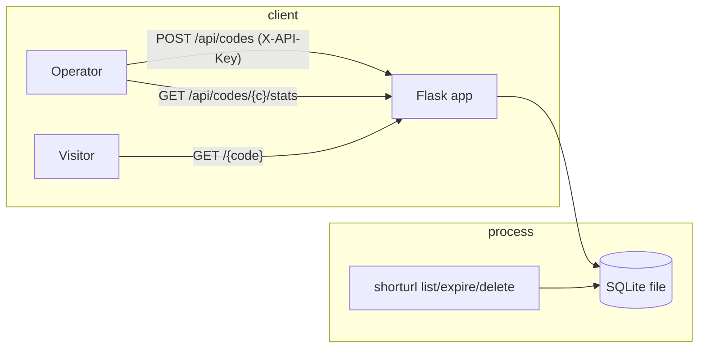
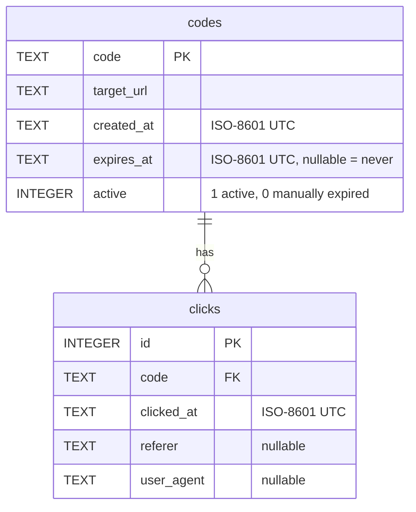
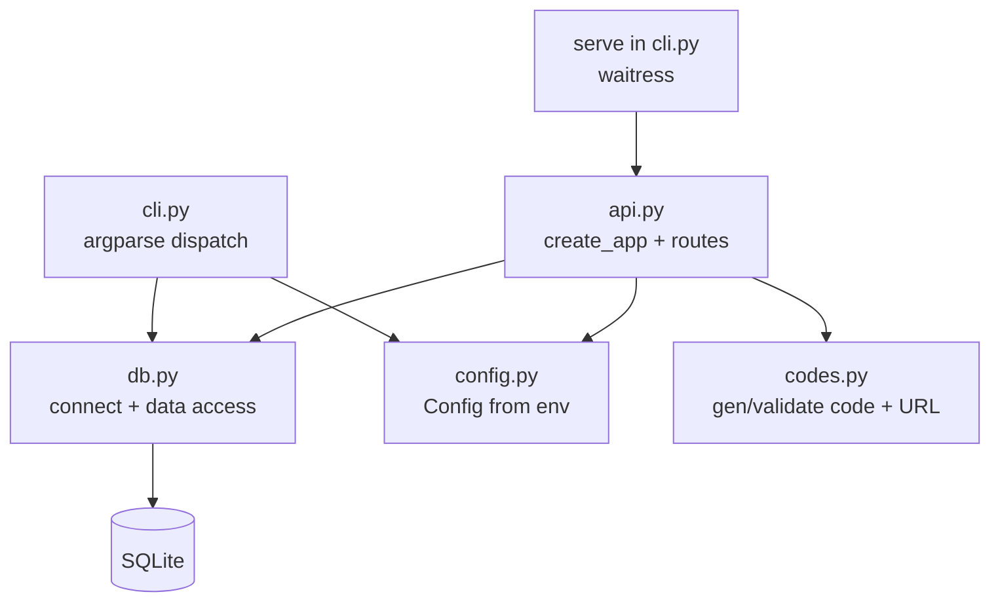

# Design: URL Shortener Service

Upstream spec: ../2026-07-14T16-27-26Z/spec.md

## Overview

One installable Python package, `shorturl`, exposing a **single console script** with
subcommands: `serve` runs the HTTP API; `list` / `expire` / `delete` are the admin CLI.
Both paths import the **same persistence module** and open the **same SQLite file**, so
there is exactly one source of truth (satisfies spec AC #13, #14).

The persistence layer is a set of plain functions over a `sqlite3.Connection` — the
connection is *passed in*, never constructed inside a data-access function (profile
style: separate creation from use). The API layer is a thin Flask application: a
`create_app(config)` factory wires routes, an API-key check on `/api/*`, and JSON error
handling; each request gets its own connection (SQLite connections are not shared across
threads, and the WSGI server is multithreaded). The CLI layer is an `argparse` dispatcher
that opens one connection per command and calls the same persistence functions.

Request flow at a glance:



Redirects use HTTP **302** (temporary) so every hit reaches the click recorder and a
target can be repointed later (spec assumption confirmed here).

## Data model

Two tables. Timestamps are ISO-8601 UTC **text** (`sqlite3` has no native datetime;
ISO-8601 sorts lexically, so range/day queries work on the string). `active` is an
integer flag (SQLite has no boolean). Foreign keys are enforced per-connection
(`PRAGMA foreign_keys = ON`) so deleting a code cascades its clicks.



```sql
CREATE TABLE IF NOT EXISTS codes (
    code       TEXT PRIMARY KEY,
    target_url TEXT NOT NULL,
    created_at TEXT NOT NULL,
    expires_at TEXT,
    active     INTEGER NOT NULL DEFAULT 1
);
CREATE TABLE IF NOT EXISTS clicks (
    id         INTEGER PRIMARY KEY AUTOINCREMENT,
    code       TEXT NOT NULL REFERENCES codes(code) ON DELETE CASCADE,
    clicked_at TEXT NOT NULL,
    referer    TEXT,
    user_agent TEXT
);
CREATE INDEX IF NOT EXISTS idx_clicks_code ON clicks(code);
```

A code's **status** is derived, not stored. For **display/reporting** (CLI `list`, stats
`status`) it is three-way, matching the spec's vocabulary:

- `deactivated` — `active = 0` (manually expired via CLI), regardless of TTL;
- `expired` — `active = 1` **and** `expires_at` is non-null and `<= now` (lapsed by TTL);
- `active` — otherwise.

For the **redirect gate**, both non-active outcomes are treated the same: `410 Gone` when
the status is `deactivated` or `expired`, `302` only when `active`. A single helper
`status(row, now) -> Literal["active", "expired", "deactivated"]` in `codes.py` is the one
source of this logic; `is_expired` becomes `status(...) != "active"`. Enforcing expiry at
read time (rather than a background job) keeps the service a single process with no
scheduler.

## Module & component design

`src/` layout, package `shorturl`. Functions over classes throughout; the only "state"
objects are an immutable `Config` dataclass and the `sqlite3.Connection`.



| Module | Responsibility | Key functions (signatures illustrative) |
| --- | --- | --- |
| `shorturl/config.py` | Read env into an immutable `Config` (frozen dataclass): `db_path`, `api_key`, `host`, `port`, `base_url`. Validation (e.g. `serve` needs `api_key`). `base_url` is optional; when unset it defaults to `http://{host}:{port}` (a `SHORTURL_BASE_URL` override exists for reverse-proxy/custom-domain deployments). | `Config.from_env() -> Config` |
| `shorturl/db.py` | Open/configure a connection (WAL, `foreign_keys=ON`, `busy_timeout`, `row_factory`), create schema, and all data access. Every function takes `conn` first. `list_codes` LEFT JOINs a per-code click count (`GROUP BY code`) so the CLI renders counts without an N+1 query. | `connect(db_path) -> Connection`, `init_schema(conn)`, `insert_code(conn, code, url, created_at, expires_at)`, `get_code(conn, code) -> Row \| None`, `insert_click(conn, code, at, referer, ua)`, `get_stats(conn, code) -> dict`, `list_codes(conn) -> list[Row]` (each row carries `click_count`), `expire_code(conn, code) -> bool`, `delete_code(conn, code) -> bool` |
| `shorturl/codes.py` | Pure helpers: random base62 generation, alias charset validation, URL validation, three-way status. No I/O. `CODE_LENGTH` is a module-level constant (default 7), not runtime config. | `generate_code(length=CODE_LENGTH) -> str`, `is_valid_alias(s) -> bool`, `validate_url(s) -> str` (normalized) / raises, `status(row, now) -> Literal["active","expired","deactivated"]` |
| `shorturl/api.py` | `create_app(config) -> Flask`. Per-request connection (`before_request`/`teardown`). Routes: create, redirect, stats. API-key gate on `/api/*`. JSON error handlers mapping domain errors → 400/401/403/404/409/410. | `create_app(config)` |
| `shorturl/cli.py` | `argparse` with subcommands `serve`, `list`, `expire`, `delete`. `serve` builds the app and runs it under **waitress**; admin commands open a connection and call `db`. Exit non-zero on unknown code. | `main(argv=None) -> int` |
| `shorturl/__init__.py` | Version string only. | — |

**Console script:** `pyproject.toml` → `[project.scripts] shorturl = "shorturl.cli:main"`.
Single entry point; `shorturl serve` starts the API, the other subcommands are admin.

### HTTP endpoints

| Method & path | Auth | Success | Errors |
| --- | --- | --- | --- |
| `POST /api/codes` | API key | `201` `{code, short_url, target_url, expires_at}` | `400` bad URL / bad alias body, `401` no key, `403` wrong key, `409` alias taken |
| `GET /{code}` | public | `302` → `Location: target_url` (+ click recorded) | `404` unknown, `410` expired/deactivated |
| `GET /api/codes/{code}/stats` | API key | `200` `{code, target_url, status, total, series[], top_referers[]}` | `401/403` auth, `404` unknown |

Create request body: `{"url": "...", "alias": "optional", "expires_at": "optional ISO-8601"}`.

**Stats computation** (`get_stats`): `total` = `COUNT(*)` of clicks for the code. `series`
is **per-day**, computed as `GROUP BY substr(clicked_at, 1, 10)` (valid because
`clicked_at` is ISO-8601 UTC text — the first 10 chars are the `YYYY-MM-DD` date), yielding
`[{ "date": "YYYY-MM-DD", "count": N }, …]` ordered by date. `top_referers` is
`GROUP BY referer` (NULLs excluded) ordered by count desc, limited to 10, as
`[{ "referer": "...", "count": N }, …]`. `status` is the three-way label from
`codes.status`.

## Key algorithms & libraries

- **Flask** (WSGI) for the API — minimal, synchronous (matches `sqlite3`'s blocking
  nature; no async ceremony for an I/O-trivial workload), first-class `app.test_client()`
  for tests. Chosen over FastAPI (drags in async + pydantic for no benefit here) and raw
  `http.server` (hand-rolled routing/JSON is more code and more bugs). See D1.
- **waitress** for serving — a tiny, pure-Python, cross-platform WSGI server so
  "single deployable service" is real and production-safe, instead of shipping Flask's
  dev server (which warns against production use). See D2.
- **argparse** (stdlib) for the CLI — zero dependencies; subcommand support is enough for
  `serve`/`list`/`expire`/`delete`. Chosen over click/typer to keep the dependency
  surface minimal (profile: simplicity first). See D3.
- **`sqlite3`** (stdlib) with **WAL mode** + `busy_timeout` — WAL lets the redirect path
  (writer) and stats/list (readers) coexist with less locking; `busy_timeout` turns
  transient `database is locked` into a short wait instead of an error. See D4.
- **Base62 random codes** via `secrets.choice` over `[A-Za-z0-9]`, default length 7
  (62⁷ ≈ 3.5×10¹²). Unpredictable (not a sequential counter, so codes aren't
  enumerable) and collision-safe at expected volume; insert relies on the PRIMARY KEY
  `UNIQUE` constraint and retries a few times on the astronomically rare clash. See D5.
- **`hmac.compare_digest`** for API-key comparison — constant-time, avoids leaking the
  key via timing.
- **`urllib.parse`** (stdlib) for URL validation — accept only `http`/`https` with a
  non-empty netloc.
- Time via `datetime.now(timezone.utc)`, stored/compared as ISO-8601 strings.

## Edge cases & failure modes

| Case | Intended behavior |
| --- | --- |
| Custom alias already exists | `insert_code` hits `UNIQUE` → API returns `409`; no row added. |
| Auto-gen code collides | Retry generation up to 5×; exhausting all returns `500` (effectively never at 62⁷). |
| Malformed / non-http(s) URL | `validate_url` raises → `400`; no row. |
| Missing API key on `/api/*` | `401`. Wrong key → `403`. Redirect route is unaffected (public). |
| `expires_at` given in the past at creation | Accepted; the code is immediately expired → redirect returns `410`. |
| Redirect to expired (TTL passed) or deactivated code | `410 Gone`; **no click recorded**. |
| Redirect to unknown code | `404`; no click recorded. |
| Malformed `expires_at` in create body | `400` (ISO-8601 parse failure). |
| Delete a code | Row removed; clicks cascade-deleted (`ON DELETE CASCADE` + `foreign_keys=ON`). |
| CLI `expire`/`delete` on unknown code | Message to stderr, process exits `1` (functions return `False` → CLI maps to non-zero). |
| Concurrent redirects writing clicks | WAL + `busy_timeout`; each request its own connection; writes are small single-row inserts. |
| `serve` with no `SHORTURL_API_KEY` | Refuse to start with a clear error (fail closed — never serve an unauthenticated create endpoint). |
| Referer/User-Agent header absent | Stored as `NULL`; stats simply omit them from top-referers. |
| Route ambiguity `/{code}` vs `/api/...` | `/api/*` routes are declared explicitly; `/<code>` is the fallback and never matches `/api/...`. |

## Ripple effects (ArjanCodes step 6)

- **Documentation to update:** none pre-exists (greenfield). `build` will create
  `README.md` (install, env vars, `shorturl serve`, admin commands, API examples).
- **Users/systems to notify:** none — new project, no consumers yet.
- **External systems affected:** none. The service reaches out to nothing; it only
  redirects clients to third-party target URLs (it does not fetch them).

## Broader context (ArjanCodes step 7)

- **Limitations of this design:**
  - Single SQLite file → single-writer; fine for light/moderate traffic, not for
    high-concurrency or multi-node deployment (explicitly out of scope).
  - No rate limiting or abuse protection beyond the API key — a leaked key allows
    unlimited code creation.
  - One global API key, no per-code ownership or audit of who created what.
  - Clicks accumulate unbounded (no retention/pruning) — the DB grows with traffic.
  - Expiry is lazy (checked at redirect); an expired code still occupies a row until
    deleted.
  - No open-redirect safelisting: the service will redirect to any valid http(s) URL by
    design (it is a shortener). Operators who need domain allow-listing would add it.
- **Possible future extensions:** per-user API keys + ownership; a read-only web
  dashboard over the stats endpoint; background pruning of old clicks/expired codes;
  unique-visitor counting (would require the deferred IP capture); configurable redirect
  status (301) per code.
- **Moonshots:** pluggable storage backend behind the `db` function interface (swap
  SQLite for Postgres without touching API/CLI); edge-cached redirects; per-link
  password protection.
