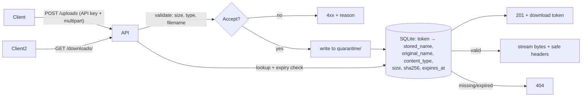

# Spec: upsafe — secure file-upload & token-download service

## Goal

Provide a small, self-hostable HTTP service that safely accepts file uploads from a
trusted client, holds every uploaded file in an isolated **quarantine** directory under
a randomized, non-user-controlled name, and hands it back only to whoever presents an
unguessable **download token**. The point of the service is to be a *defensible drop
box*: an authenticated caller can push a file in, receive an opaque capability token,
and later retrieve the exact bytes via that token — without the service ever trusting
client-supplied filenames, content types, or sizes. Security is the primary product
requirement, not a feature; the happy path is small precisely so the security boundary
around it can be reasoned about completely.

## Main concepts

- **Upload** — one multipart request carrying a single file part, authenticated by a
  static API key.
- **Quarantine** — a dedicated directory on disk. Every stored file gets a fresh random
  name; the original filename is metadata only and never a path component.
- **Stored object** — the bytes on disk plus a metadata row (token, stored name,
  original name, declared+detected content type, size, sha256, timestamps, expiry).
- **Download token** — an opaque, high-entropy, URL-safe string that is the *only*
  capability to retrieve a stored object until it expires.
- **Allow-list** — the set of permitted file types (by extension **and** sniffed
  content signature); anything else is rejected before it is persisted.

## Users & user stories

- **As an authenticated upload client**, I POST a multipart file with my API key and get
  back a download token and metadata, so that I can hand the token to a consumer without
  exposing storage internals or the original path.
- **As a download consumer**, I GET `/downloads/<token>` and receive the original bytes
  with a safe filename, so that I can retrieve the file without any account, as long as
  the token is valid and unexpired.
- **(Unhappy) As an attacker**, when I upload a file whose name is `../../etc/passwd`,
  `..\\..\\x`, an absolute path, or contains NUL/control bytes, the service stores it
  under a random name inside the quarantine and never writes outside it — so path
  traversal is structurally impossible, not merely filtered.
- **(Unhappy) As an attacker**, when I upload a disallowed type (e.g. `.exe`, or a
  `.png` whose bytes are actually a script), the service rejects it with a 4xx and
  persists nothing.
- **(Unhappy) As an attacker**, when I upload a file larger than the configured limit,
  the service refuses it without buffering the whole body into memory or leaving a
  partial file in quarantine.
- **(Unhappy) As an attacker**, when I request `/downloads/<guessed-or-expired-token>`,
  I get an indistinguishable 404 and no information about whether the token ever existed.
- **(Unhappy) As an unauthenticated client**, when I POST without a valid API key, I get
  401/403 and nothing is stored.

## Scope

- **In (MVP):**
  - `POST /uploads` — API-key-authenticated multipart upload of a single file part;
    streaming size enforcement; extension + content-signature allow-list validation;
    storage to quarantine under a random name; returns `{ token, original_name,
    content_type, size, sha256, expires_at }`.
  - `GET /downloads/<token>` — capability lookup, expiry check, streamed response with
    safe `Content-Disposition` (sanitized original name), correct `Content-Type`, and
    `X-Content-Type-Options: nosniff`.
  - `GET /healthz` — unauthenticated liveness check (no data exposure).
  - SQLite metadata store colocated with the quarantine; configuration via environment
    variables (API key, quarantine path, max size, allow-list, token TTL).
  - Structured request logging that never logs the API key, token, or file contents.
- **Out (deferred, with reasons):**
  - Antivirus / malware scanning of quarantined content — valuable but a separate
    integration; the allow-list + quarantine isolation is the MVP boundary.
  - Multi-file / chunked / resumable uploads — one file per request keeps the security
    surface small.
  - User accounts, per-user tokens, RBAC, rate limiting — single static API key is the
    MVP; multi-tenant auth is a later concern.
  - Single-use tokens and download counters — chosen model is expiring + multi-use.
  - TLS termination, deployment manifests, background expiry-sweeper daemon — expiry is
    enforced at read time; physical purging of expired files is deferred (noted as a
    follow-up).
  - A web UI — this is an API-only service.

## Constraints

- **Language/runtime:** Python 3.12, dependency + venv management via **UV**.
- **Framework:** FastAPI + uvicorn; multipart via Starlette / `python-multipart`.
- **Style/tooling (from user profile):** Black @ 119 cols, isort, flake8 + pylint, mypy,
  pytest; `src/` layout; MIT license; pre-commit. Functions over classes; explicit type
  annotations on public functions; no bare `except`.
- **Security invariants (first-class, non-negotiable):**
  1. No client-supplied string is ever used as a filesystem path component. Stored names
     are generated server-side from a CSPRNG.
  2. Every write resolves (via `realpath`) to a location strictly inside the quarantine
     root; a resolved path escaping the root is a hard error, not a warning.
  3. Size limit is enforced **while streaming**, aborting before the whole body is read
     into memory and cleaning up any partial file.
  4. Type validation combines the declared extension **and** a content-signature sniff;
     both must agree with the allow-list.
  5. Download tokens are CSPRNG-generated with ≥128 bits of entropy, URL-safe, and looked
     up in constant-ish time; invalid vs. expired are externally indistinguishable (both
     404).
  6. The API key is compared with a constant-time comparison and read from config/env,
     never hard-coded; it is never logged.
  7. Responses set `X-Content-Type-Options: nosniff`; downloads are served as
     attachments with a sanitized filename and never as inline HTML.
- **Operational:** stateless process except for the quarantine dir + SQLite file, both
  under one configurable data root; no network egress required.

## Acceptance criteria

Each is observable via an automated test, a curl command, or a log/file inspection.

1. **Auth enforced:** `POST /uploads` without a valid API key returns 401/403 and creates
   no file and no DB row. With the correct key, a permitted file returns 201 and a token.
2. **Allow-list by extension:** uploading a disallowed extension (e.g. `.exe`) returns
   4xx and persists nothing.
3. **Allow-list by content signature:** uploading a file with a permitted extension but
   mismatched/forbidden magic bytes (e.g. a script renamed `.png`) returns 4xx and
   persists nothing.
4. **Size limit:** uploading a file exceeding `MAX_UPLOAD_BYTES` returns 413, leaves no
   partial file in quarantine, and does not load the full body into memory (verified by
   streaming-abort behavior / peak-memory bound in the test).
5. **Path-traversal defense:** uploading with `filename="../../etc/passwd"` (and Windows
   `..\\`, absolute, and NUL/control-byte variants) stores the bytes under a random name
   inside the quarantine; no file is created anywhere outside the quarantine root, proven
   by asserting the resolved path is within the root.
6. **Random storage names:** two uploads of identical content produce two distinct,
   non-guessable on-disk names, neither equal to the original filename.
7. **Token round-trip:** the token from a successful upload retrieves the exact original
   bytes (sha256 matches) via `GET /downloads/<token>`, with `Content-Disposition:
   attachment`, the correct `Content-Type`, and `X-Content-Type-Options: nosniff`.
8. **Token opacity:** a syntactically valid but non-existent token and an expired token
   both return 404 with identical bodies; the response reveals nothing distinguishing the
   two cases.
9. **Expiry:** a token past its TTL returns 404 and the file is treated as unavailable.
10. **No secret leakage:** across a full upload+download cycle, application logs contain
    neither the API key nor the download token nor file contents (verified by scanning
    captured log output).
11. **Filename sanitization on the way out:** `Content-Disposition` carries a sanitized
    version of the original name (no CR/LF/`;`/path separators), so a malicious original
    filename cannot inject headers.
12. **Health check:** `GET /healthz` returns 200 without auth and exposes no stored-file
    or config data.

## Assumptions

- A single static API key (from env/config) is sufficient authN for the MVP; the caller
  is a trusted service, not an anonymous public.
- Download tokens are bearer capabilities: possession is authorization, so the transport
  is assumed to be HTTPS in production (TLS handled by a fronting proxy, out of scope).
- The default type allow-list is a small, safe set (e.g. `png`, `jpg`/`jpeg`, `gif`,
  `pdf`, `txt`, `csv`) and is overridable via config; exact defaults to be finalized in
  design.
- Default `MAX_UPLOAD_BYTES` (e.g. 10 MiB) and default token TTL (e.g. 24h) are
  configurable; concrete defaults finalized in design.
- Metadata store is SQLite in the data root; concurrency is low (single-node) so SQLite's
  locking is adequate for the MVP.
- Expired files remain on disk until a future sweeper is built; expiry is enforced at
  read time only. Acceptable for MVP (documented limitation, not a security hole since
  the token is required to read).

## Open questions

*(None blocking. The items below are accepted as design-time decisions, not blockers.)*

- Final default allow-list, `MAX_UPLOAD_BYTES`, and TTL values — chosen in `design`.
- Content-signature detection mechanism (e.g. `filetype`/`python-magic` vs. a small
  hand-rolled signature table) — evaluated in `design` against the "minimize
  dependencies / minimize trusted surface" constraint.
