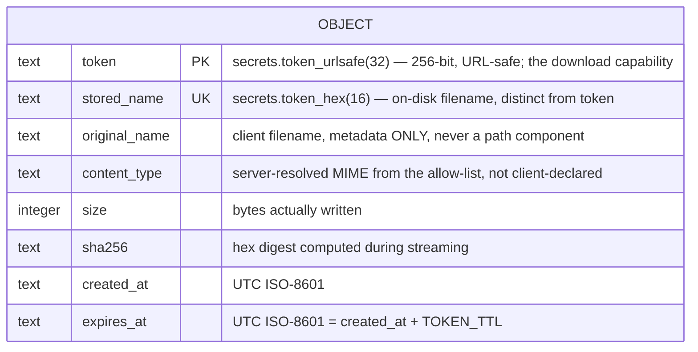
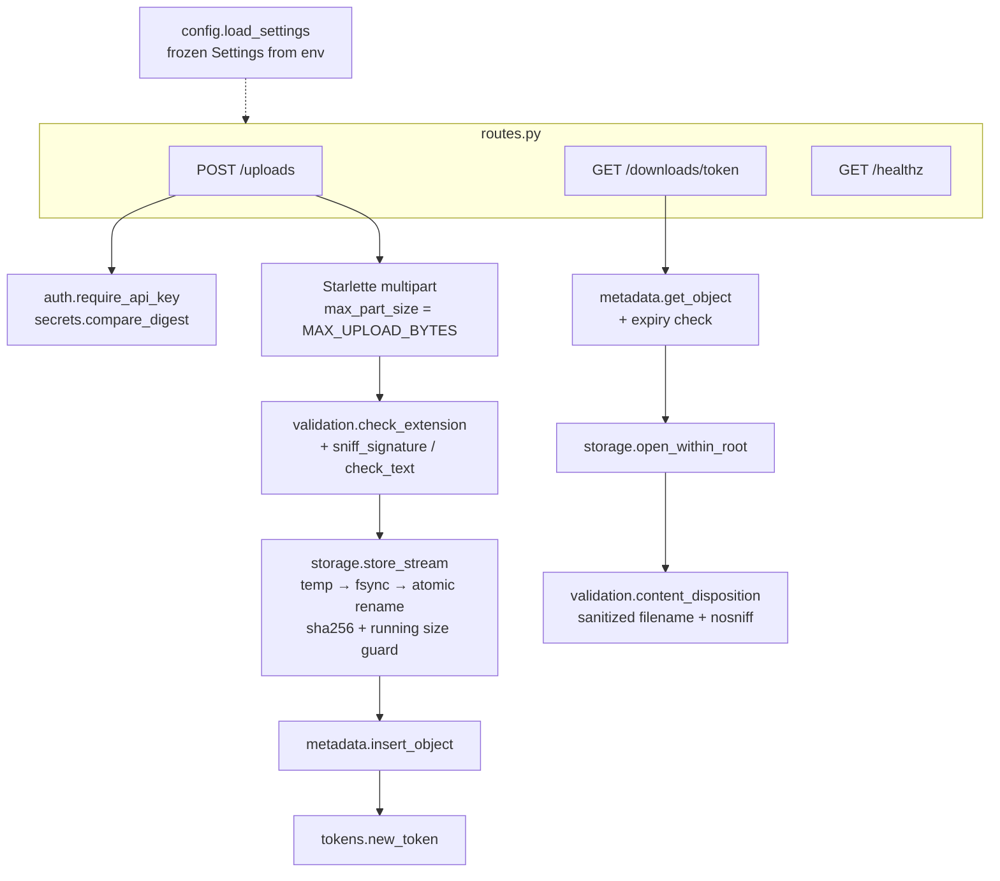

# Design: upsafe — secure file-upload & token-download service

Upstream spec: .claude/vibe-reports/2026-07-18T17-03-13Z/spec.md

## Overview

upsafe is a single FastAPI application with three routes (`POST /uploads`,
`GET /downloads/{token}`, `GET /healthz`) and a flat set of small, single-responsibility
modules. All state lives under one configurable **data root**: a `quarantine/`
subdirectory for file bytes and a `upsafe.db` SQLite file for metadata.

The security posture is *structural*, not filter-based:

- **Path traversal is impossible by construction.** No client-supplied string is ever a
  path component. On-disk names are generated server-side from a CSPRNG; the download
  token is a database key that never touches the filesystem. A `resolve-within-root`
  assertion is kept as belt-and-suspenders, not as the primary defense.
- **The size cap is enforced while streaming.** Starlette's multipart parser is
  configured with `max_part_size = MAX_UPLOAD_BYTES`, so an oversized body aborts mid-parse
  (→ 413) instead of being buffered whole. A running byte counter during the copy-to-disk
  step is a second, independent guard.
- **Type validation is two-layered and fail-closed.** The declared extension must be on
  the allow-list *and* the file's leading bytes must match that type's signature (binary
  types) or pass a strict text-safety check (text types). Disagreement → reject, persist
  nothing.
- **Storage is atomic and crash-consistent.** Bytes are streamed to a temp file inside
  the quarantine, `fsync`'d, atomically `rename`d to the final random name; the
  quarantine **directory is then `fsync`'d** so the rename is durable, and *only then* is
  the metadata row committed. Ordering the rename's durability before the metadata commit
  is what makes the guarantee real: a crash at any point leaves at worst an unreachable
  orphan file (no token points to it), never a committed token row over a missing file.
- **Request logging is redacting by construction.** A single structured-logging helper
  emits an explicit allow-list of fields per request (method, path, status, size,
  duration); the API key, download token, original-filename bytes, and file contents are
  never among the logged fields.

Request handling is a thin async layer; the security-critical work lives in pure,
independently testable functions (`validation`, `storage`, `tokens`) that take their
collaborators as arguments.

## Data model

- One SQLite table, `objects`, `token` as PRIMARY KEY, `stored_name` UNIQUE.
- On-disk layout: `<DATA_ROOT>/quarantine/<stored_name>` for bytes;
  `<DATA_ROOT>/upsafe.db` for metadata; temp files as
  `<DATA_ROOT>/quarantine/.tmp-<rand>` during upload.
- `content_type` is stored from the server-side allow-list mapping so downloads never
  echo an attacker-chosen MIME type.

## Module & component design

Modules (all under `src/upsafe/`, functions preferred over classes; a class only where
real state is encapsulated):

| Module | Responsibility | Key functions |
| --- | --- | --- |
| `config.py` | Parse env into an immutable `Settings` (frozen dataclass). | `load_settings() -> Settings` |
| `app.py` | App factory: build `Settings`, init DB, register routes/deps. | `create_app(settings=None) -> FastAPI` |
| `auth.py` | Constant-time API-key check as a FastAPI dependency. | `require_api_key(settings)` |
| `validation.py` | Extension allow-list, content-signature table, text-safety check, outbound filename sanitization. | `check_extension`, `sniff_signature`, `is_safe_text`, `resolve_type`, `content_disposition` |
| `storage.py` | Quarantine paths, streaming writer (size guard + sha256 + atomic publish), traversal-safe reopen. | `store_stream`, `open_within_root`, `quarantine_path` |
| `tokens.py` | Capability + on-disk name generation. | `new_token`, `new_stored_name` |
| `metadata.py` | SQLite schema + insert/lookup with expiry. | `init_db`, `insert_object`, `get_object` |
| `logging.py` | Structured, redacting request-log helper: emits only an explicit field allow-list; owns criterion 10. | `configure_logging`, `log_request` |
| `routes.py` | The three endpoints; orchestrate the above; map errors to status codes. | `upload`, `download`, `healthz` |
| `errors.py` | Small typed exceptions (`FileTooLarge`, `TypeNotAllowed`, `EmptyUpload`) → HTTP mapping. | — |
| `__main__.py` | `uvicorn` entry (`python -m upsafe`). | — |

**Upload flow (`POST /uploads`):**
1. `require_api_key` dependency runs first (constant-time compare); fail → 401.
2. Parse multipart with `max_part_size = MAX_UPLOAD_BYTES`, `max_files=1`; a
   `MultiPartException` for size → 413. Require exactly one non-empty file part → else 400.
3. `check_extension(filename)` against the allow-list → fail → 415 (persist nothing;
   body not yet written).
4. `store_stream`: read the part in fixed chunks; capture the first ≤512 bytes; after the
   first chunk, run `sniff_signature`/`is_safe_text` for the declared type → mismatch →
   abort, unlink temp, 415. Otherwise write chunks to `.tmp-<rand>`, updating a sha256 and
   a running byte counter (redundant cap guard → 413 on breach). `fsync`, close.
5. Atomic `os.rename` temp → `quarantine/<stored_name>`, then `fsync` the quarantine
   directory so the rename is durable before any metadata is committed.
6. `insert_object` with a fresh `new_token()` (commit); on DB failure, unlink the
   published file. `stored_name` is UNIQUE — a collision (negligible at 128 bits) fails
   the insert and triggers the same cleanup rather than serving a wrong file.
7. Return 201 `{token, original_name, content_type, size, sha256, expires_at}`.
8. `log_request` records method/path/status/size/duration only — never token, key,
   filename, or bytes.

**Download flow (`GET /downloads/{token}`):**
1. `get_object(token)`: single primary-key lookup; if row missing **or**
   `expires_at <= now` → return an identical 404 (indistinguishable).
2. `open_within_root(stored_name)`: build path, `realpath`, assert inside quarantine root;
   open read-only.
3. Stream a `FileResponse` with server-resolved `Content-Type`,
   `X-Content-Type-Options: nosniff`, and a sanitized `Content-Disposition: attachment`.

## Key algorithms & libraries

- **FastAPI + uvicorn** — async HTTP, dependency injection for auth, Pydantic response
  model. *Why:* spec-mandated; best-supported streaming multipart in Python.
- **Starlette multipart (`python-multipart`)** — `max_part_size` gives a *streaming*,
  framework-tested size abort. *Why:* using battle-tested parser code shrinks our
  hand-written security-critical surface vs. rolling our own multipart parser. Two
  Starlette behaviors are load-bearing and pinned/verified at build time: `max_part_size`
  (the abort threshold) and the `SpooledTemporaryFile` spool threshold (parts spool to
  disk past ~1 MiB — this is what bounds peak memory). The criterion-4 test asserts a
  concrete peak-memory bound so a future Starlette change is caught, not silently absorbed.
- **`secrets`** — `token_urlsafe(32)` (256-bit token), `token_hex(16)` (stored name),
  `compare_digest` (API-key check). *Why:* CSPRNG + constant-time compare, stdlib.
- **`hashlib.sha256`** — incremental digest during streaming. *Why:* integrity proof for
  the round-trip criterion; no extra pass over the file.
- **Hand-rolled signature table** (in `validation.py`) — a small dict mapping each
  allow-listed binary type to its magic-byte prefix(es); text types validated by a strict
  **valid-UTF-8 + no NUL/control-byte** check (the load-bearing, fail-closed guard).
  A leading-`<` HTML/script rejection is kept only as a conservative, *optional*
  defense-in-depth flag — downloads are already served as `attachment` + `nosniff` so
  stored HTML never renders inline; it is documented as such (D1) because it can
  false-positive on legitimate `.txt`/`.csv` beginning with `<`, and must not be mistaken
  for a hard requirement. *Why:*
  the allow-list is tiny and static; a ~20-line audited table avoids adding
  `python-magic` (needs libmagic system lib) or `filetype` (extra trusted dependency) —
  minimizing trusted surface is the whole point of this service.
- **stdlib `sqlite3`** — metadata store. *Why:* zero-dep, single-node concurrency is low,
  atomic transactions for the insert.
- **`os.rename` + `fsync`** — atomic publish on one filesystem. *Why:* no torn/partial
  published files.
- **`urllib.parse.quote`** — RFC 5987 `filename*` encoding for `Content-Disposition`.

## Edge cases & failure modes

| Case | Behavior |
| --- | --- |
| No file part / >1 file part | 400; nothing written. |
| Zero-byte file | 400 (nothing to store, cannot sniff). |
| Oversized body | 413 mid-stream (Starlette abort); temp unlinked. |
| Disallowed extension | 415 before body is written to disk. |
| Extension on-list but bytes mismatch (script as `.png`) | 415; temp (if any) unlinked. |
| Filename `../../etc/passwd`, `..\\`, absolute, NUL/control bytes | Stored under random name inside quarantine; original kept as metadata only; write path asserted within root. |
| DB insert fails after file published | Published file unlinked; 500. Never a dangling DB row. |
| Crash between publish and insert | Orphan file with no token (unreachable; future sweeper reclaims). Never a row→missing-file. |
| Disk full during write | Temp unlinked; 500. |
| Unknown token | 404, identical body to expired. |
| Expired token | 404, identical body to unknown; file left on disk (read-time expiry). |
| Concurrent downloads of one token | Both succeed (multi-use, read-only). |
| Malicious original filename in `Content-Disposition` | CR/LF/`;`/quotes/path-seps stripped; unicode via percent-encoded `filename*`; no header injection. |
| Missing/blank `UPSAFE_API_KEY` at startup | Fail fast at boot (refuse to start with no key). |

## Ripple effects (ArjanCodes step 6)

- **Documentation to update:** new repo — author `README.md` (run/config/curl examples),
  a `CLAUDE.md` for the agent (via `env`), and a `.env.example` listing every setting.
- **Users/systems to notify:** none (greenfield); callers integrate against the documented
  API + API key.
- **External systems affected:** none in MVP. Operationally, whoever deploys must front
  the service with TLS and provision the data-root volume.

## Broader context (ArjanCodes step 7)

- **Limitations of this design:**
  - No malware/AV scanning: allow-list + quarantine isolation is the boundary, not
    content safety. A permitted-type file can still be malicious *content*.
  - No physical purge of expired files (read-time expiry only); disk grows until a sweeper
    is added.
  - Single static API key = coarse authN; no per-caller identity, revocation, or rate
    limiting. A leaked key is total.
  - SQLite = single-node; no horizontal scale-out of the metadata store.
  - Signature table covers only the small allow-list; adding a type means adding a
    signature.
- **Possible future extensions:** background expiry sweeper; pluggable AV scan step before
  publish; single-use tokens + download counters; per-caller API keys with scopes + rate
  limits; S3/object-store backend behind the same `storage` interface.
- **Moonshots:** content-defined dedupe (store-once by sha256 with reference-counted
  tokens); encrypt-at-rest with per-object keys derived from the token so the quarantine
  is useless without the capability; pluggable "scan pipeline" that quarantines, scans,
  and promotes files through states.
